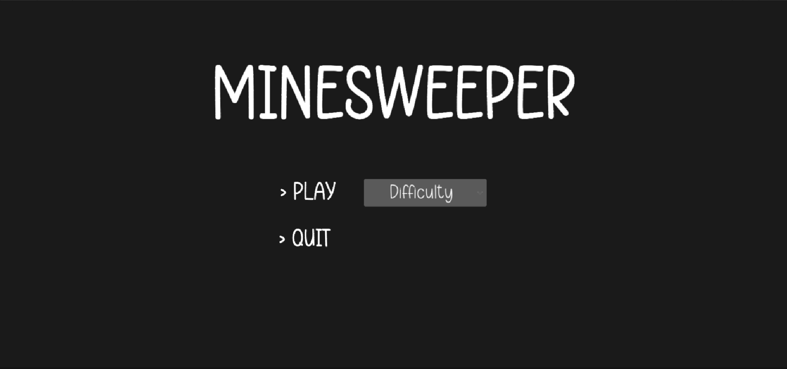
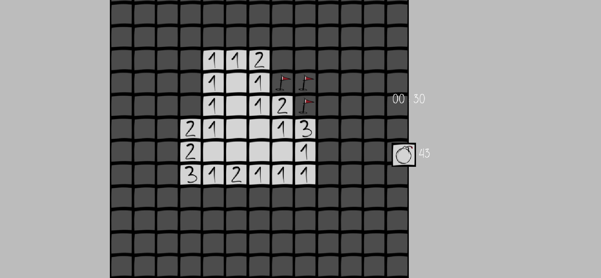
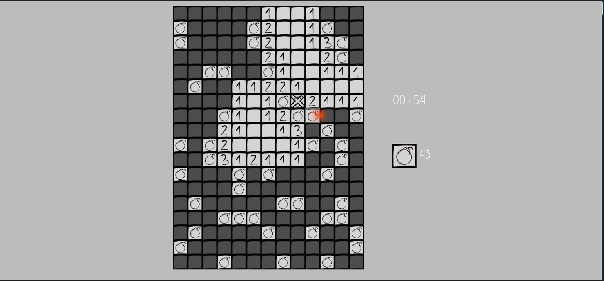
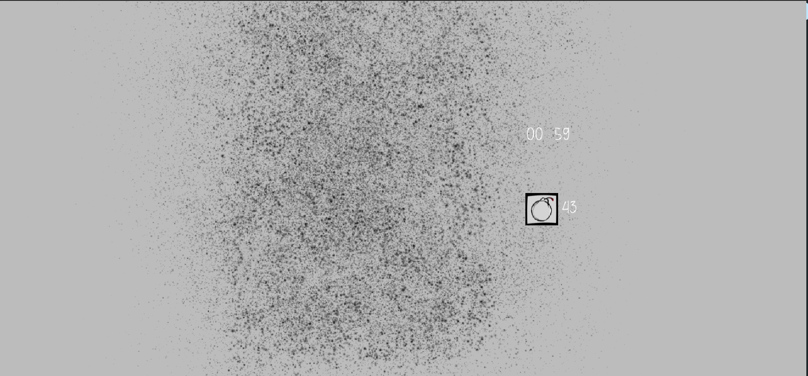

# MinesWeeper

*20-02-2023* to *02-03-2023*

First use of Unity and creation of a Mines Weeper game
[Leann](https://github.com/LeannF) and
[Justine](https://github.com/Justine-dt)

The project was made on Microsoft Visual Studio & Rider. 

The game takes the rules of the MinesSweeper. No additions were made. 

## Game features

*to be implemented :*
* Custom games (size, number of bombs)
  * Grid generation using a seed
* Save of the progression.
* Better animations and sound effects.

*implemented :*
* Grid generation with bombs and clues. The bombs are generated after the first click.
* Menuing with difficulty management and Win & Lose popUps.
* Animations for the bomb explosion and the tiles fade out.
* Sound effects for the bomb explosion.
* Timer and bomb counter.

### Controls 

**Gameplay** : Left click to reveal a tile, right click to flag a tile.
**Camera Management** : Scroll to zoom in and out, drag to move the camera.

### Game Screenshots

#### Menu

#### Game

